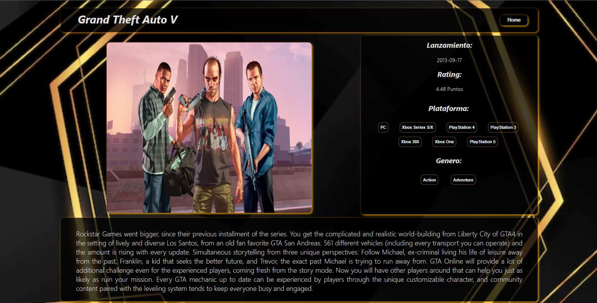

<p align="center">
  
</p>

# Proyecto individual -  Videogames

## Objetivos del Proyecto

- Construir una App utlizando React, Redux, Node y Sequelize.
- Afirmar y conectar los conceptos aprendidos en la carrera.
- Aprender mejores prácticas.
- Aprender y practicar el workflow de GIT.

## Instrucciones de uso

__IMPORTANTE:__ Es necesario contar minimamente con la última versión estable de Node y NPM. Asegurarse de contar con ella para poder instalar correctamente las dependecias necesarias para correr el proyecto.

Actualmente las versiónes necesarias son:

 * __Node__: 12.18.3 o mayor
 * __NPM__: 6.14.16 o mayor

Para verificar que versión tienen instalada:

> node -v
>
> npm -v

## BoilerPlate

El boilerplate cuenta con dos carpetas: `api` y `client`. En estas carpetas estará el código del back-end y el front-end respectivamente.

En `api` crear un archivo llamado: `.env` que tenga la siguiente forma:

```
DB_USER=usuariodepostgres
DB_PASSWORD=passwordDePostgres
DB_HOST=localhost
```

Reemplazar `usuariodepostgres` y `passwordDePostgres` con tus propias credenciales para conectarte a postgres. Este archivo va ser ignorado en la subida a github, ya que contiene información sensible (las credenciales).

Adicionalmente será necesario que creen desde psql una base de datos llamada `videogames`

El contenido de `client` fue creado usando: Create React App.

## Enunciado

La idea general es crear una aplicación en la cual se puedan ver los distintos videojuegos disponibles junto con información relevante de los mismos utilizando la api externa [rawg](https://rawg.io/apidocs) y a partir de ella poder, entre otras cosas:

  - Buscar videjuegos
  - Filtrarlos / Ordenarlos
  - Agregar nuevos videojuegos

__IMPORTANTE__: Para poder utilizar esta API externa es necesario crearse una cuenta para obtener una API Key que luego debera ser incluida en todos los request que hagamos a rawg simplemente agregando `?key={YOUR_API_KEY}` al final de cada endpoint. Agregar la clave en el archivo `.env` para que la misma no se suba al repositorio por cuestiones de seguridad y utilizarla desde allí.

#### Tecnologías utilizadas:
- [ ] React
- [ ] Redux
- [ ] Express
- [ ] Sequelize - Postgres
- [ ] HTML
- [ ] CSS
- [ ] Node.js
- [ ] Javascript

#### Base de datos

El modelo de la base de datos contiene las siguientes entidades:

- [ ] Videojuego con las siguientes propiedades:
  - ID: diferenciado de un videojuego ya existente en la API rawg
  - Nombre 
  - Descripción 
  - Fecha de lanzamiento
  - Rating
  - Plataformas 
- [ ] Genero con las siguientes propiedades:
  - ID
  - Nombre

La relación entre ambas entidades es de muchos a muchos ya que un videojuego puede pertenecer a varios géneros en simultaneo y, a su vez, un género puede contener múltiples videojuegos distintos. 

#### Backend

Se servidor desarrollado en Node/Express con las siguientes rutas:

- [ ] __GET /videogames__:
  - Obtener un listado de los videojuegos
  - Debe devolver solo los datos necesarios para la ruta principal
- [ ] __GET /videogames?name="..."__:
  - Obtener un listado de las primeros 15 videojuegos que contengan la palabra ingresada como query parameter
  - Si no existe ningún videojuego mostrar un mensaje adecuado
- [ ] __GET /videogame/{idVideogame}__:
  - Obtener el detalle de un videojuego en particular
  - Debe traer solo los datos pedidos en la ruta de detalle de videojuego
  - Incluir los géneros asociados
- [ ] __GET /genres__:
  - Obtener todos los tipos de géneros de videojuegos posibles
  - En una primera instancia se han traído todos los géneros desde rawg y y se han guardado en la base de datos y  utilizardos desde allí
- [ ] __POST /videogame__:
  - Recibe los datos recolectados desde el formulario controlado de la ruta de creación de videojuego por body
  - Crea un videojuego en la base de datos

#### Frontend

Se debe desarrollar una aplicación de React/Redux que contenga las siguientes pantallas/rutas.

__Pagina inicial__: deben armar una landing page con
- [ ] Alguna imagen de fondo representativa al proyecto
- [ ] Botón para ingresar al home (`Ruta principal`)

<p align="center">
  
</p>

__Ruta principal__: debe contener
- [ ] Input de búsqueda para encontrar videojuegos por nombre
- [ ] Área donde se verá el listado de videojuegos. Deberá mostrar su:
  - Imagen
  - Nombre
  - Géneros
- [ ] Botones/Opciones para filtrar por género y por videojuego existente o agregado por nosotros
- [ ] Botones/Opciones para ordenar tanto ascendentemente como descendentemente los videojuegos por orden alfabético y por rating
- [ ] Paginado para ir buscando y mostrando los siguientes videojuegos, 15 juegos por pagina, mostrando los primeros 15 en la primer pagina.

<p align="center">

</p>

__IMPORTANTE__: se muestran tanto los videjuegos traidos desde la API como así también los de la base de datos. Debido a que en la API existen alrededor de 500 mil juegos, por cuestiones de performance se obtuvieron y paginaron los primeros 100.

__Ruta de detalle de videojuego__: debe contener
- [ ] Los campos mostrados en la ruta principal para cada videojuegos (imagen, nombre, y géneros)
- [ ] Descripción
- [ ] Fecha de lanzamiento
- [ ] Rating
- [ ] Plataformas

<p align="center">

</p>

__Ruta de creación de videojuegos__: debe contener
- [ ] Un formulario __controlado con JavaScript__ con los siguientes campos:
  - Nombre
  - Descripción
  - Fecha de lanzamiento
  - Rating
- [ ] Posibilidad de seleccionar/agregar varios géneros
- [ ] Posibilidad de seleccionar/agregar varias plataformas
- [ ] Botón/Opción para crear un nuevo videojuego

> Es requisito que el formulario de creación esté validado con JavaScript y no sólo con validaciones HTML. 

<p align="center">

</p>

